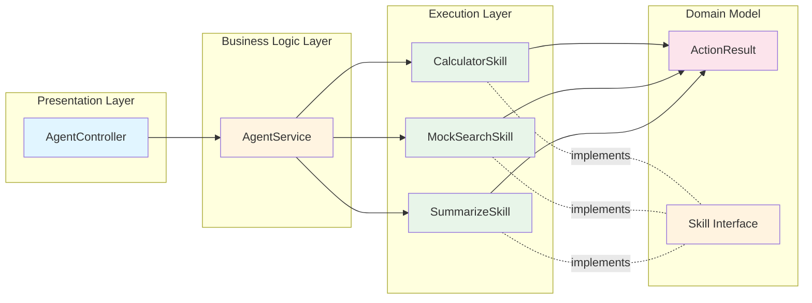
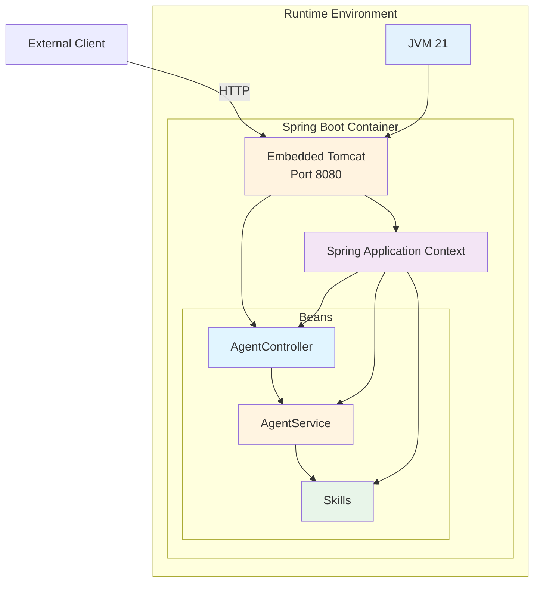

# Spring AI Agent Demo - Architecture Documentation

## Table of Contents
1. [System Overview](#system-overview)
2. [Architecture Diagram](#architecture-diagram)
3. [Component Details](#component-details)
4. [Design Patterns](#design-patterns)
5. [Technology Stack](#technology-stack)

---

## System Overview

The Spring AI Agent Demo is a modular, skill-based agent system built with Spring Boot. It demonstrates a simple but extensible architecture where an agent can execute goals by delegating to appropriate skills based on the nature of the request.

### Key Characteristics
- **Modular Design**: Skills are independent components that can be added/removed
- **Strategy Pattern**: Skill selection based on capability matching
- **RESTful API**: HTTP-based interface for external clients
- **Extensible**: Easy to add new skills without modifying core logic

---

## Architecture Diagram

### High-Level System Architecture

```mermaid
graph TB
    Client[HTTP Client]
    
    subgraph "Spring Boot Application"
        Controller[AgentController<br/>@RestController]
        Service[AgentService<br/>@Service]
        
        subgraph "Skill Registry"
            Skill1[CalculatorSkill<br/>@Component]
            Skill2[MockSearchSkill<br/>@Component]
            Skill3[SummarizeSkill<br/>@Component]
            SkillN[Future Skills...]
        end
        
        Interface[Skill Interface]
        Model[ActionResult<br/>Model]
    end
    
    Client -->|POST /api/agent/execute| Controller
    Controller -->|executeGoal| Service
    Service -->|canHandle?| Skill1
    Service -->|canHandle?| Skill2
    Service -->|canHandle?| Skill3
    Service -->|canHandle?| SkillN
    
    Skill1 -.implements.- Interface
    Skill2 -.implements.- Interface
    Skill3 -.implements.- Interface
    SkillN -.implements.- Interface
    
    Skill1 -->|returns| Model
    Skill2 -->|returns| Model
    Skill3 -->|returns| Model
    
    Service -->|List<ActionResult>| Controller
    Controller -->|JSON Response| Client
    
    style Controller fill:#e1f5ff
    style Service fill:#fff4e1
    style Skill1 fill:#e8f5e9
    style Skill2 fill:#e8f5e9
    style Skill3 fill:#e8f5e9
    style SkillN fill:#f0f0f0
    style Interface fill:#fff3e0
    style Model fill:#fce4ec
```

### Layer Architecture



---

## Component Details

### 1. **AgentController** (Presentation Layer)
- **Location**: `com.example.agentdemo.controller`
- **Role**: REST API endpoint handler
- **Responsibilities**:
  - Receives HTTP POST requests at `/api/agent/execute`
  - Extracts goal from request body
  - Delegates execution to AgentService
  - Formats response with trace and final output

### 2. **AgentService** (Business Logic Layer)
- **Location**: `com.example.agentdemo.agent`
- **Role**: Core orchestration service
- **Responsibilities**:
  - Maintains registry of available skills
  - Iterates through skills to find capable handler
  - Executes first matching skill
  - Returns execution trace
  - Handles fallback when no skill matches

### 3. **Skill Interface** (Contract Definition)
- **Location**: `com.example.agentdemo.agent`
- **Methods**:
  - `boolean canHandle(String goal)`: Determines if skill can process the goal
  - `ActionResult execute(String goal)`: Executes the skill logic

### 4. **Skill Implementations** (Execution Layer)

#### CalculatorSkill
- **Capabilities**: Mathematical calculations
- **Triggers**: "calculate", "compute", "sum", numeric expressions
- **Logic**: Regex-based expression parsing, supports +, -, *, /

#### MockSearchSkill
- **Capabilities**: Information retrieval simulation
- **Triggers**: "search", "find", "lookup"
- **Logic**: Returns mock search results for demonstration

#### SummarizeSkill
- **Capabilities**: Text summarization
- **Triggers**: "summarize", "summary", "summarise"
- **Logic**: Extracts first sentence or first 120 characters

### 5. **ActionResult** (Domain Model)
- **Location**: `com.example.agentdemo.model`
- **Properties**:
  - `boolean success`: Execution status
  - `String skillName`: Name of skill that executed
  - `String output`: Result of execution

---

## Design Patterns

### 1. **Strategy Pattern**
The Skill interface defines a family of algorithms (skills), making them interchangeable. AgentService uses the interface without knowing concrete implementations.

```java
// Strategy Interface
public interface Skill {
    boolean canHandle(String goal);
    ActionResult execute(String goal);
}

// Context
public class AgentService {
    private final List<Skill> skills; // Strategies injected
}
```

### 2. **Dependency Injection**
Spring's IoC container automatically:
- Discovers all `@Component` beans implementing Skill
- Injects them into AgentService constructor
- Manages lifecycle and dependencies

### 3. **Chain of Responsibility**
AgentService iterates through skills until one accepts the responsibility:
```java
for (Skill skill : skills) {
    if (skill.canHandle(goal)) {
        return skill.execute(goal);
    }
}
```

### 4. **Template Method (Implicit)**
Each Skill follows the same two-step template:
1. Check capability (`canHandle`)
2. Execute if capable (`execute`)

---

## Technology Stack

| Component | Technology | Version |
|-----------|-----------|---------|
| **Language** | Java | 21 (LTS) |
| **Framework** | Spring Boot | 3.2.11 |
| **Web Layer** | Spring Web MVC | (bundled) |
| **Build Tool** | Apache Maven | 3.x |
| **Testing** | JUnit 5 + Spring Test | (bundled) |
| **Server** | Embedded Tomcat | (bundled) |
| **API Style** | RESTful HTTP/JSON | - |

### Dependencies

```xml
<dependencies>
    <dependency>
        <groupId>org.springframework.boot</groupId>
        <artifactId>spring-boot-starter-web</artifactId>
    </dependency>
    <dependency>
        <groupId>org.springframework.boot</groupId>
        <artifactId>spring-boot-starter-test</artifactId>
        <scope>test</scope>
    </dependency>
</dependencies>
```

---

## Deployment Architecture



---

## Scalability Considerations

### Current Architecture
- Single instance
- In-memory skill registry
- Synchronous processing

### Future Enhancements
1. **Horizontal Scaling**: Stateless design allows multiple instances behind load balancer
2. **Async Processing**: Use Spring's `@Async` for long-running skills
3. **Skill Discovery**: Dynamic skill loading from plugins
4. **Caching**: Add caching layer for repeated queries
5. **Observability**: Add metrics, tracing, and logging (Spring Actuator)

---

## Security Considerations

### Current State
- No authentication/authorization
- Public API endpoint
- Input validation minimal

### Recommended Enhancements
1. Add Spring Security for authentication
2. Implement rate limiting
3. Input sanitization for each skill
4. API key or OAuth2 token validation
5. HTTPS enforcement

---

*Generated: November 8, 2025*  
*Project: Spring AI Agent Demo v0.0.1-SNAPSHOT*
