# Spring AI Agent Demo - Interaction Diagrams & Workflows

## Table of Contents
1. [Request Processing Workflows](#request-processing-workflows)
2. [Skill Execution Patterns](#skill-execution-patterns)
3. [Spring Bean Lifecycle](#spring-bean-lifecycle)
4. [Communication Patterns](#communication-patterns)
5. [Deployment Scenarios](#deployment-scenarios)

---

## Request Processing Workflows

### 1. Happy Path - Successful Execution

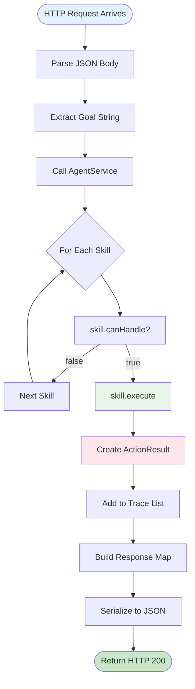

### 2. Alternative Path - No Skill Match

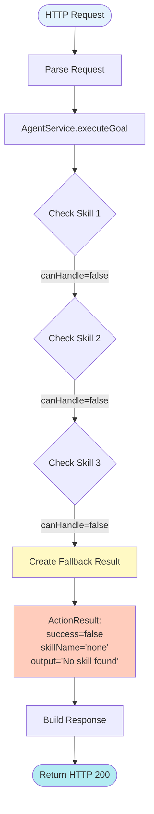

### 3. Error Path - Skill Execution Exception

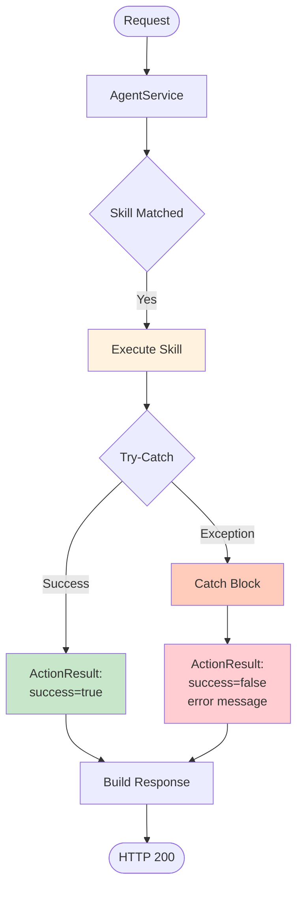

---

## Skill Execution Patterns

### CalculatorSkill Workflow

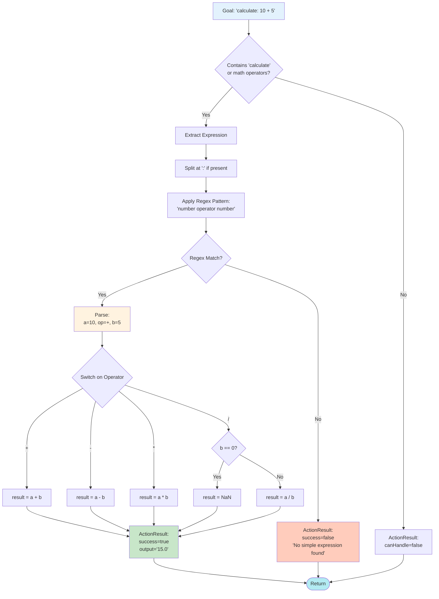

### MockSearchSkill Workflow

```mermaid
flowchart TD
    Input[Goal: 'search: Java tutorials'] --> Check{Contains 'search'<br/>or 'find' or 'lookup'?}
    
    Check -->|No| Return1[canHandle=false]
    Check -->|Yes| Extract[Extract Query]
    
    Extract --> Split{Contains ':'?}
    Split -->|Yes| AfterColon[query = text after ':']
    Split -->|No| Full[query = full goal]
    
    AfterColon --> Generate[Generate Mock Results]
    Full --> Generate
    
    Generate --> Format[Format as:<br/>1) Result A<br/>2) Result B<br/>3) Result C]
    
    Format --> Success[ActionResult:<br/>success=true<br/>skillName='MockSearchSkill'<br/>output=formatted results]
    
    Success --> End([Return])
    Return1 --> End
    
    style Input fill:#e3f2fd
    style Generate fill:#e8f5e9
    style Success fill:#c8e6c9
    style End fill:#b2ebf2
```

### SummarizeSkill Workflow

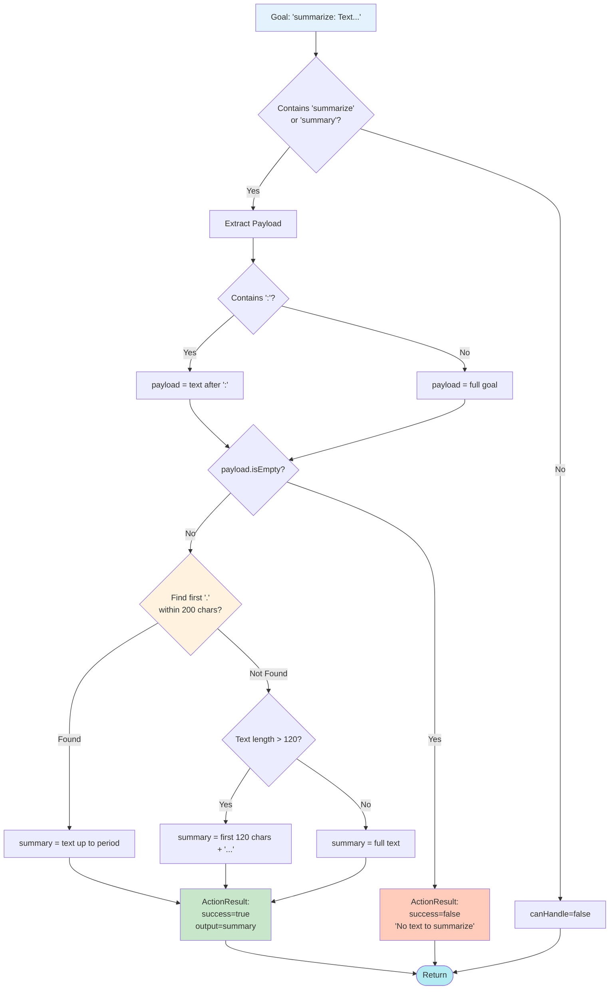

---

## Spring Bean Lifecycle

### Application Startup Sequence

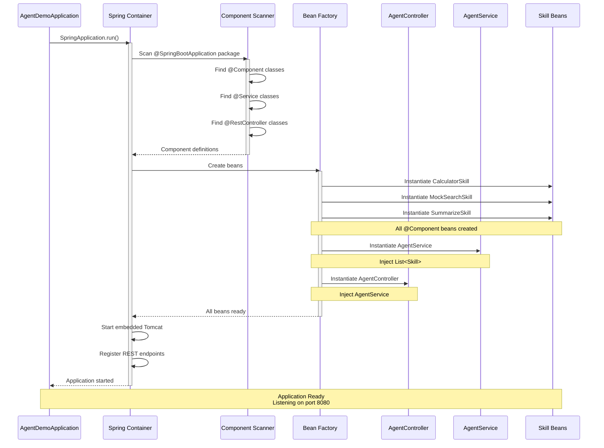

### Dependency Injection Flow

```mermaid
graph TB
    subgraph "Spring IoC Container"
        BeanDef[Bean Definitions]
        
        subgraph "Skill Beans"
            B1[CalculatorSkill<br/>@Component]
            B2[MockSearchSkill<br/>@Component]
            B3[SummarizeSkill<br/>@Component]
        end
        
        B4[AgentService<br/>@Service]
        B5[AgentController<br/>@RestController]
        
        BeanDef --> B1
        BeanDef --> B2
        BeanDef --> B3
        BeanDef --> B4
        BeanDef --> B5
    end
    
    B1 -->|Auto-collected| Collection[List&lt;Skill&gt;]
    B2 -->|Auto-collected| Collection
    B3 -->|Auto-collected| Collection
    
    Collection -->|Constructor Injection| B4
    B4 -->|Constructor Injection| B5
    
    Request[HTTP Request] -->|Routes to| B5
    
    style BeanDef fill:#e3f2fd
    style B1 fill:#e8f5e9
    style B2 fill:#e8f5e9
    style B3 fill:#e8f5e9
    style B4 fill:#fff4e1
    style B5 fill:#e1f5ff
    style Collection fill:#fff3e0
```

---

## Communication Patterns

### HTTP Request/Response Cycle

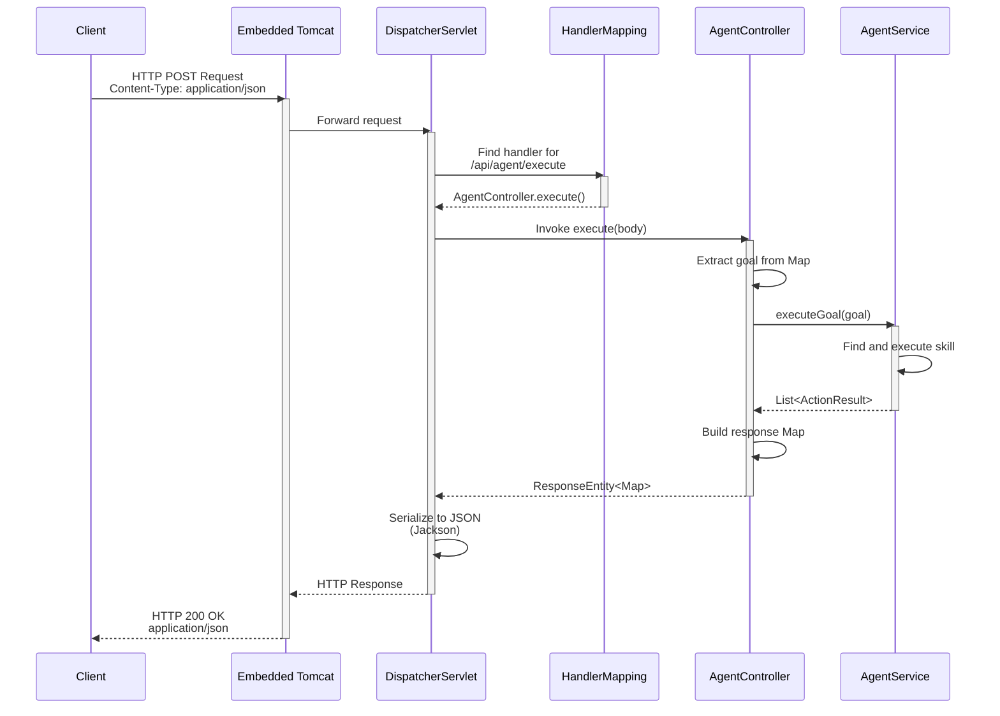

### Internal Component Communication

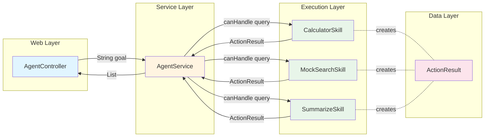

---

## Deployment Scenarios

### Local Development Deployment

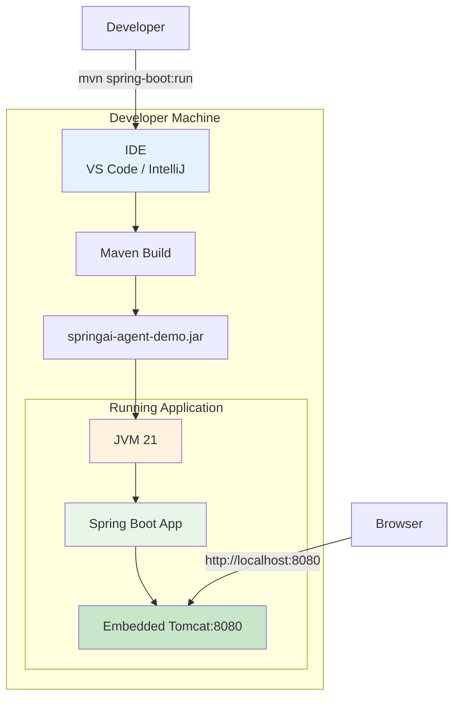

### Docker Containerized Deployment

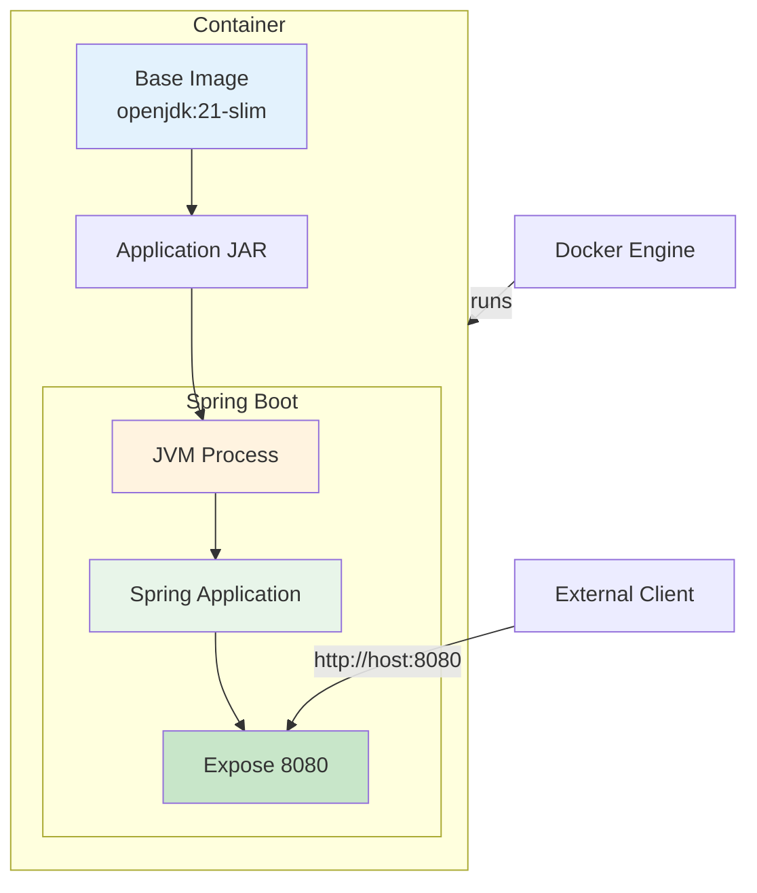

#### Sample Dockerfile

```dockerfile
FROM eclipse-temurin:21-jre-jammy

WORKDIR /app

COPY target/springai-agent-demo-0.0.1-SNAPSHOT.jar app.jar

EXPOSE 8080

ENV JAVA_OPTS="-Xmx512m -Xms256m"

ENTRYPOINT ["sh", "-c", "java $JAVA_OPTS -jar app.jar"]
```

### Cloud Deployment (Kubernetes)

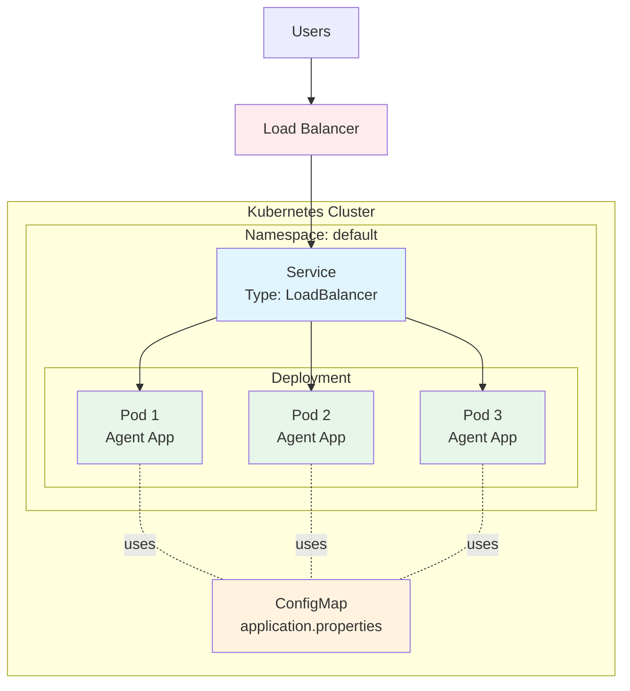

#### Sample Kubernetes Manifests

**Deployment:**
```yaml
apiVersion: apps/v1
kind: Deployment
metadata:
  name: agent-demo
spec:
  replicas: 3
  selector:
    matchLabels:
      app: agent-demo
  template:
    metadata:
      labels:
        app: agent-demo
    spec:
      containers:
      - name: agent-demo
        image: agent-demo:latest
        ports:
        - containerPort: 8080
        resources:
          requests:
            memory: "256Mi"
            cpu: "250m"
          limits:
            memory: "512Mi"
            cpu: "500m"
```

**Service:**
```yaml
apiVersion: v1
kind: Service
metadata:
  name: agent-demo-service
spec:
  type: LoadBalancer
  selector:
    app: agent-demo
  ports:
  - port: 80
    targetPort: 8080
```

---

## Complete End-to-End Flow

### Multi-Step Interaction (Future Enhancement)

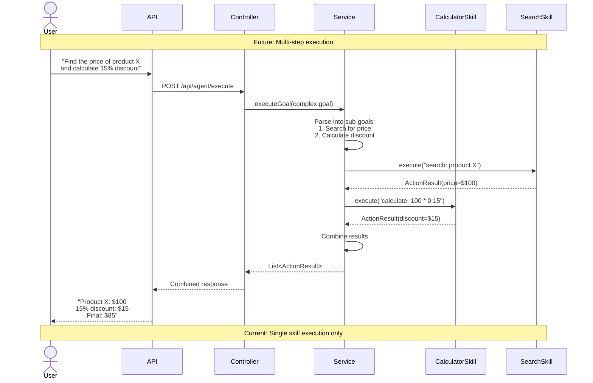

---

## Performance & Monitoring

### Request Timeline

```mermaid
gantt
    title HTTP Request Processing Timeline
    dateFormat X
    axisFormat %L ms
    
    section Network
    Request Arrival           :0, 5
    Response Sent            :95, 100
    
    section Web Layer
    Parse JSON               :5, 10
    Controller Execution     :10, 15
    Response Building        :90, 95
    
    section Service Layer
    AgentService.executeGoal :15, 85
    Skill Iteration          :15, 25
    
    section Execution Layer
    Skill Execution          :25, 80
    Business Logic           :25, 75
    Result Creation          :75, 80
    
    section Trace Building
    Add to Trace             :80, 85
```

### Metrics Collection Points (Future)

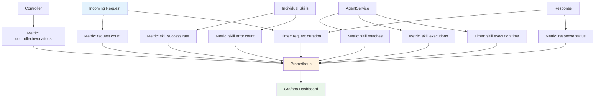

---

## Security Flow (Future Enhancement)

### Authentication & Authorization Flow

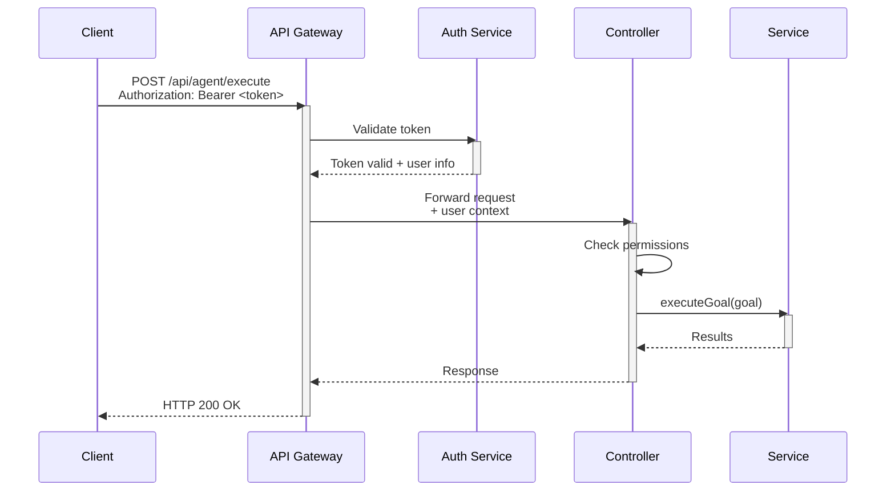

---

## Development Workflow

### Local Development Cycle

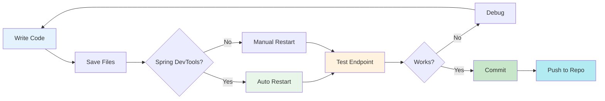

### CI/CD Pipeline (Future)

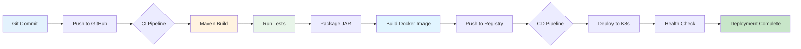

---

*Generated: November 8, 2025*  
*Project: Spring AI Agent Demo v0.0.1-SNAPSHOT*  
*Interaction Diagrams Version: 1.0*
