# Spring AI Agent Demo - Technical Specification

## Table of Contents
1. [System Specification](#system-specification)
2. [API Specification](#api-specification)
3. [Interaction Diagrams](#interaction-diagrams)
4. [Sequence Diagrams](#sequence-diagrams)
5. [Data Flow](#data-flow)
6. [Component Interactions](#component-interactions)
7. [Error Handling](#error-handling)

---

## System Specification

### Application Metadata
- **Project Name**: springai-agent-demo
- **Group ID**: com.example
- **Artifact ID**: springai-agent-demo
- **Version**: 0.0.1-SNAPSHOT
- **Packaging**: JAR
- **Java Version**: 21
- **Spring Boot Version**: 3.2.11

### Runtime Configuration
- **Server Port**: 8080
- **Context Path**: /
- **Base API Path**: /api/agent

---

## API Specification

### Endpoint: Execute Agent Goal

#### Request
```http
POST /api/agent/execute
Content-Type: application/json

{
  "goal": "calculate: 10 + 5"
}
```

#### Response (Success)
```http
HTTP/1.1 200 OK
Content-Type: application/json

{
  "goal": "calculate: 10 + 5",
  "trace": [
    {
      "success": true,
      "skillName": "CalculatorSkill",
      "output": "15.0"
    }
  ],
  "finalOutput": "15.0"
}
```

#### Response (No Skill Found)
```http
HTTP/1.1 200 OK
Content-Type: application/json

{
  "goal": "unknown command",
  "trace": [
    {
      "success": false,
      "skillName": "none",
      "output": "No skill found to handle goal: unknown command"
    }
  ],
  "finalOutput": "No skill found to handle goal: unknown command"
}
```

### Supported Goal Formats

| Goal Type | Example | Handler Skill |
|-----------|---------|---------------|
| **Calculation** | `calculate: 2 + 3` | CalculatorSkill |
| | `compute: 10 * 5` | CalculatorSkill |
| | `sum: 7 - 2` | CalculatorSkill |
| **Search** | `search: Spring Boot docs` | MockSearchSkill |
| | `find: Java tutorials` | MockSearchSkill |
| | `lookup: best practices` | MockSearchSkill |
| **Summarization** | `summarize: Long text here...` | SummarizeSkill |
| | `summary: Article content...` | SummarizeSkill |

---

## Interaction Diagrams

### 1. Complete Request Flow

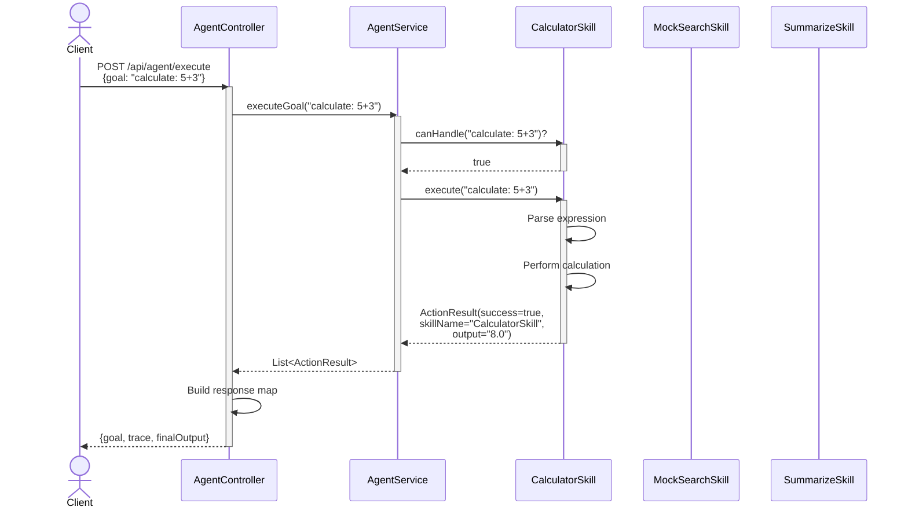

### 2. Skill Selection Process

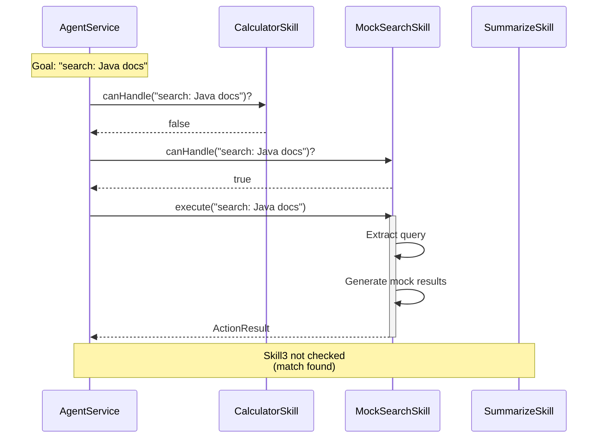

### 3. No Skill Found Flow

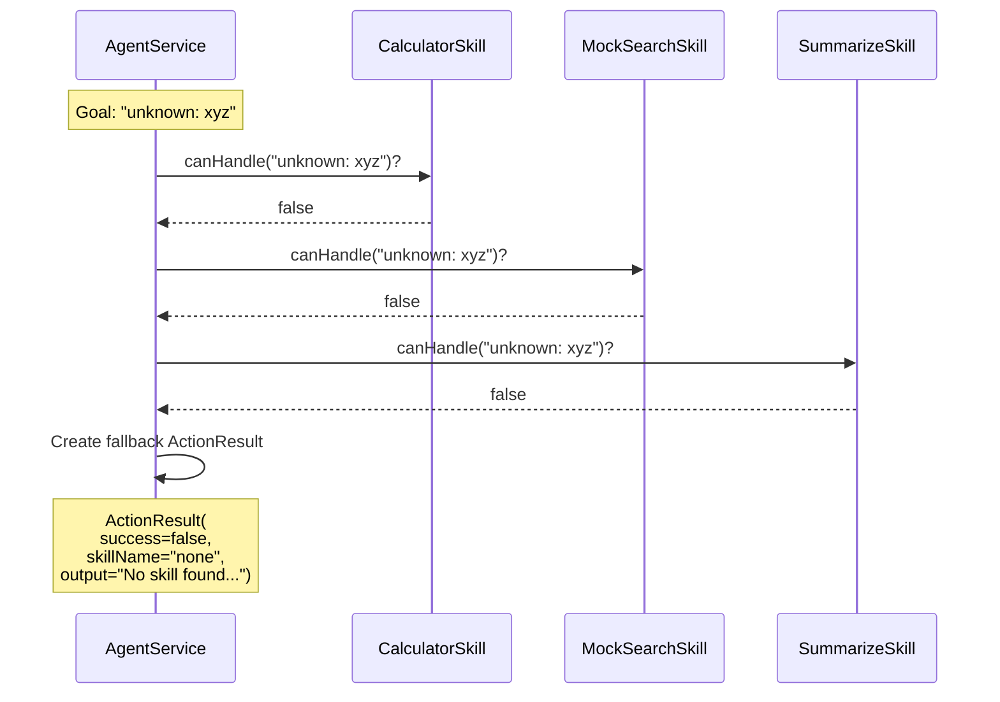

---

## Sequence Diagrams

### 1. Calculation Request Flow

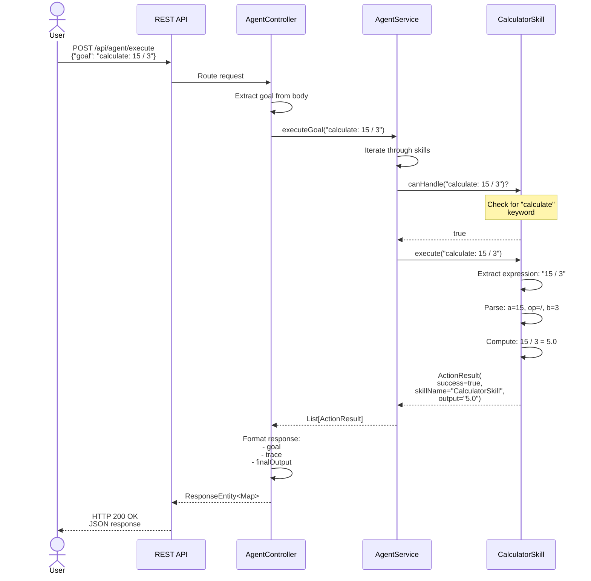

### 2. Search Request Flow

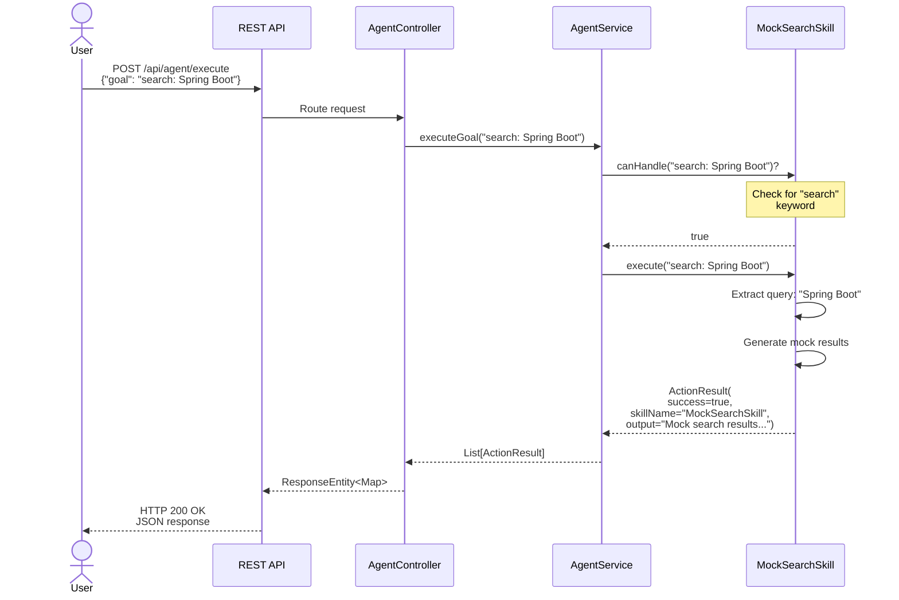

### 3. Summarization Request Flow

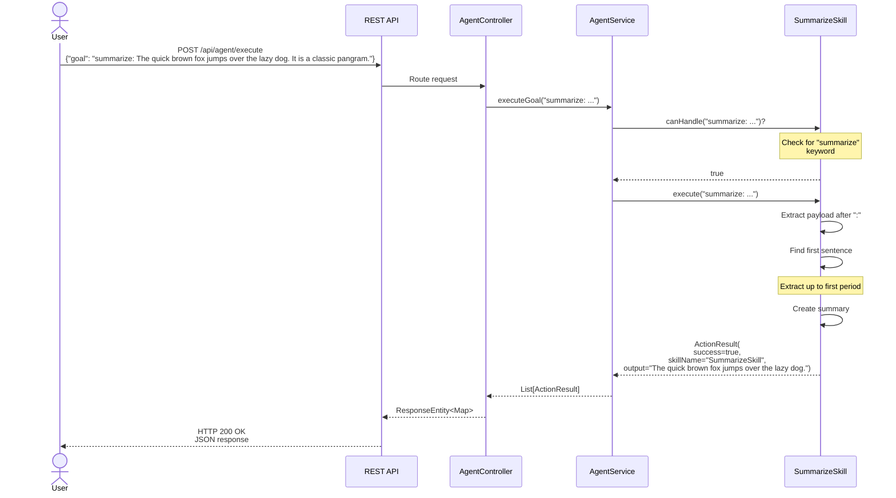

---

## Data Flow

### Component Data Flow Diagram

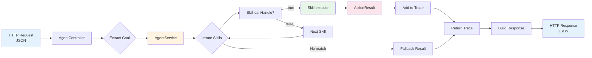

### Data Models

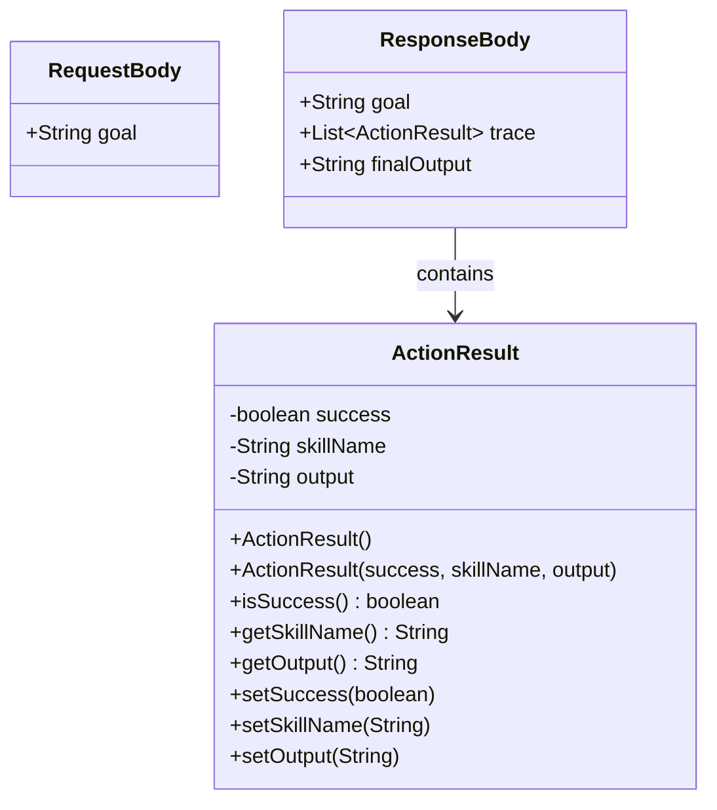

---

## Component Interactions

### Class Diagram

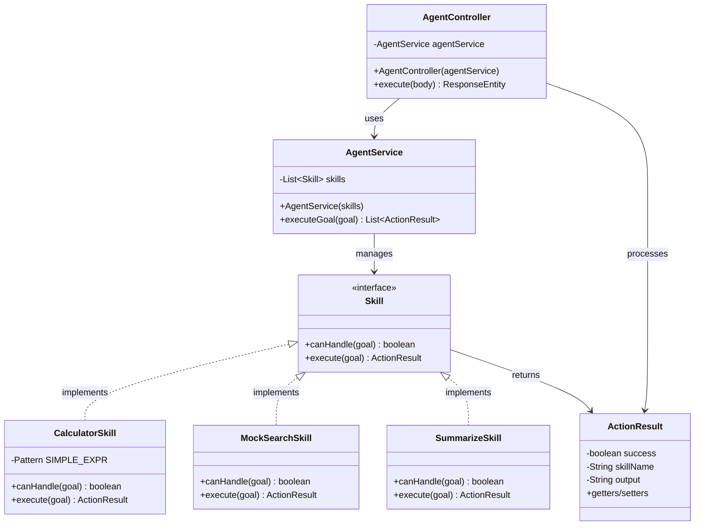

### Object Interaction at Runtime

```mermaid
graph TB
    subgraph "Spring Context"
        AC[AgentController<br/>Bean]
        AS[AgentService<br/>Bean]
        CS[CalculatorSkill<br/>Bean]
        MS[MockSearchSkill<br/>Bean]
        SS[SummarizeSkill<br/>Bean]
    end
    
    AC -->|@Autowired| AS
    AS -->|@Autowired<br/>List injection| CS
    AS -->|@Autowired<br/>List injection| MS
    AS -->|@Autowired<br/>List injection| SS
    
    Client[HTTP Client] -->|Request| AC
    AC -->|Response| Client
    
    style AC fill:#e1f5ff
    style AS fill:#fff4e1
    style CS fill:#e8f5e9
    style MS fill:#e8f5e9
    style SS fill:#e8f5e9
    style Client fill:#ffebee
```

---

## Error Handling

### Error Scenarios

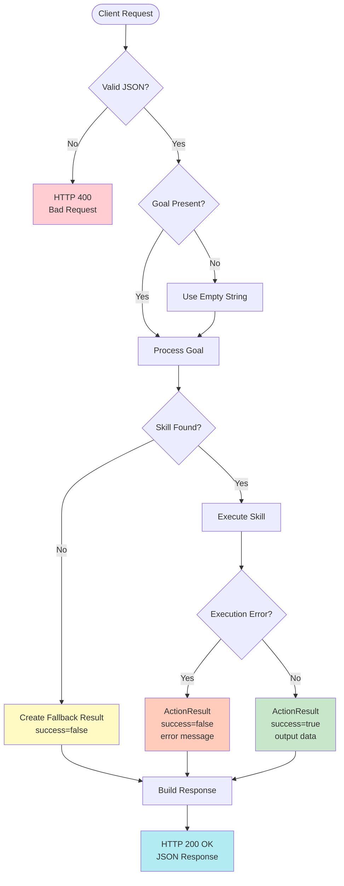

### Skill-Specific Error Handling

#### CalculatorSkill
```java
// Division by zero
input: "calculate: 5 / 0"
output: ActionResult(success=true, output="NaN")

// Invalid expression
input: "calculate: abc"
output: ActionResult(success=false, output="No simple expression found")

// Parse error
input: "calculate: 2 ++ 3"
output: ActionResult(success=false, output="Error evaluating expression")
```

#### SummarizeSkill
```java
// Empty payload
input: "summarize:"
output: ActionResult(success=false, output="No text to summarize")

// Valid but minimal
input: "summarize: Hi"
output: ActionResult(success=true, output="Hi")
```

#### MockSearchSkill
```java
// Always succeeds with mock data
input: "search: [any query]"
output: ActionResult(success=true, output="Mock search results...")
```

---

## State Diagram

### AgentService State Flow

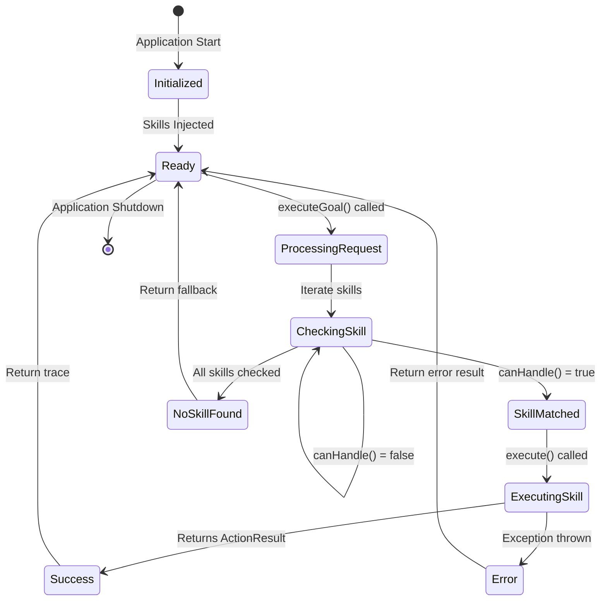

---

## Performance Specifications

### Expected Response Times
| Operation | Target | Notes |
|-----------|--------|-------|
| Calculator Skill | < 10ms | Simple arithmetic |
| Search Skill | < 50ms | Mock data generation |
| Summarize Skill | < 20ms | String manipulation |
| Overall Request | < 100ms | Including network overhead |

### Scalability Metrics
- **Concurrent Requests**: 100+ (limited by Tomcat default thread pool)
- **Memory Footprint**: ~200MB (typical Spring Boot app)
- **Skill Limit**: No hard limit, constrained by memory

---

## Testing Specification

### Test Coverage

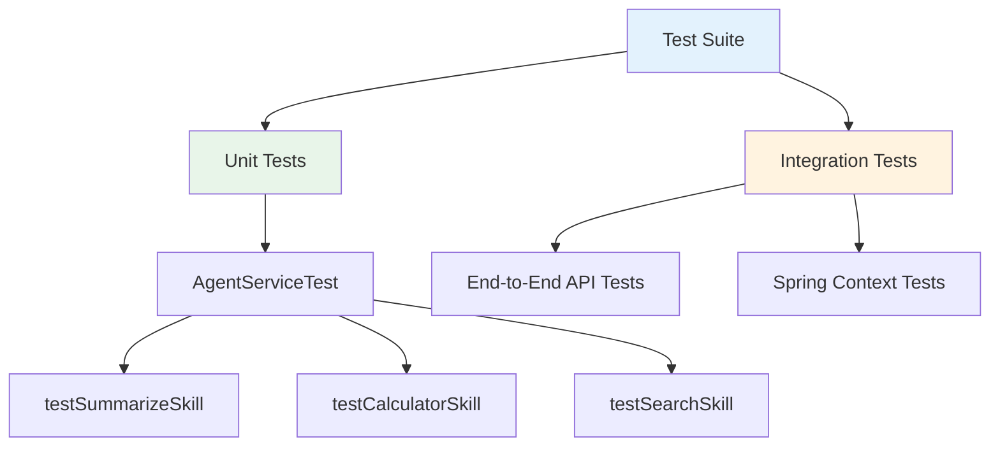

### Sample Test Cases

#### CalculatorSkill Tests
```java
@Test
void testCalculatorSkill() {
    List<ActionResult> trace = agentService.executeGoal("calculate: 5 + 3");
    assertEquals("CalculatorSkill", trace.get(0).getSkillName());
    assertEquals("8.0", trace.get(0).getOutput());
    assertTrue(trace.get(0).isSuccess());
}
```

#### SummarizeSkill Tests
```java
@Test
void testSummarizeSkill() {
    List<ActionResult> trace = agentService.executeGoal(
        "summarize: The quick brown fox. Second sentence.");
    assertEquals("SummarizeSkill", trace.get(0).getSkillName());
    assertEquals("The quick brown fox.", trace.get(0).getOutput());
}
```

#### MockSearchSkill Tests
```java
@Test
void testSearchSkill() {
    List<ActionResult> trace = agentService.executeGoal("search: Java docs");
    assertEquals("MockSearchSkill", trace.get(0).getSkillName());
    assertTrue(trace.get(0).getOutput().contains("Mock search results"));
}
```

---

## Extension Points

### Adding New Skills

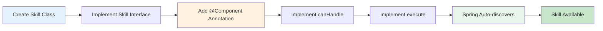

### Example: Adding a TranslateSkill

```java
@Component
public class TranslateSkill implements Skill {
    @Override
    public boolean canHandle(String goal) {
        return goal != null && 
               goal.toLowerCase().contains("translate");
    }
    
    @Override
    public ActionResult execute(String goal) {
        // Implementation
        return new ActionResult(true, 
                               "TranslateSkill", 
                               "Translated text");
    }
}
```

---

## Configuration Specification

### Application Properties
```properties
# Server Configuration
server.port=8080

# Logging (future)
logging.level.com.example.agentdemo=DEBUG

# Actuator (future)
management.endpoints.web.exposure.include=health,info,metrics
```

### Build Configuration
```xml
<build>
    <plugins>
        <plugin>
            <groupId>org.springframework.boot</groupId>
            <artifactId>spring-boot-maven-plugin</artifactId>
        </plugin>
    </plugins>
</build>
```

---

## Monitoring and Observability (Future)

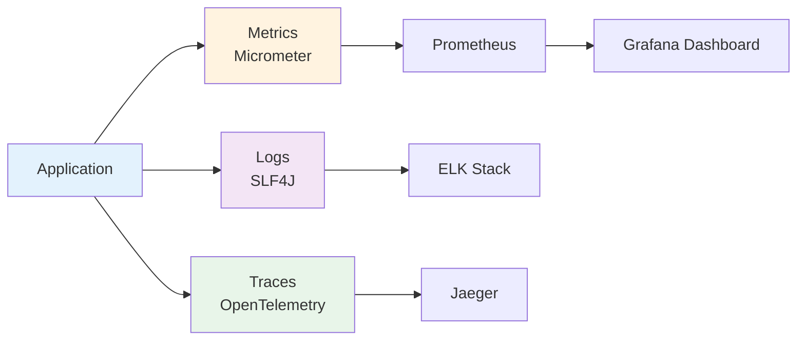

---

*Generated: November 8, 2025*  
*Project: Spring AI Agent Demo v0.0.1-SNAPSHOT*  
*Technical Specification Version: 1.0*
