# Spring AI Agent Demo - Visual Summary

A quick visual reference guide for the Spring AI Agent Demo application.

---

## 🎯 System At-A-Glance

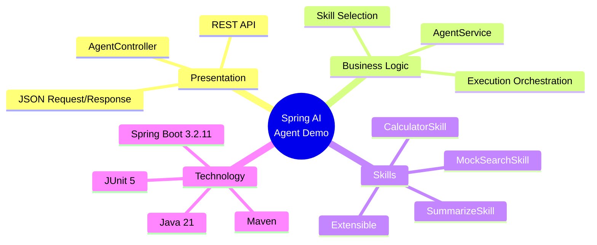

---

## 🔄 Request Flow Overview

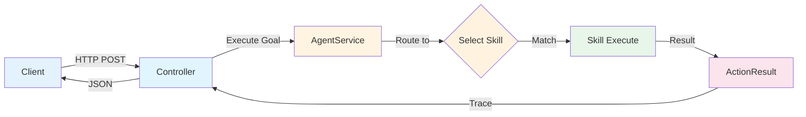

---

## 🧩 Component Relationships

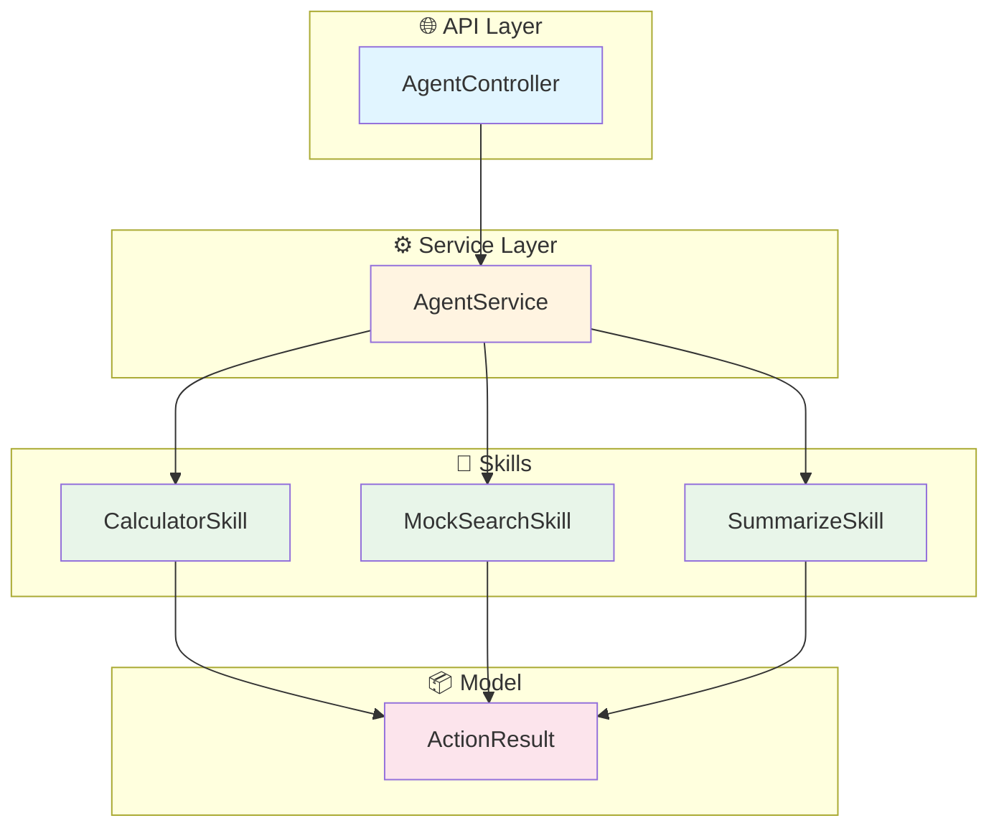

---

## 📊 Technology Stack

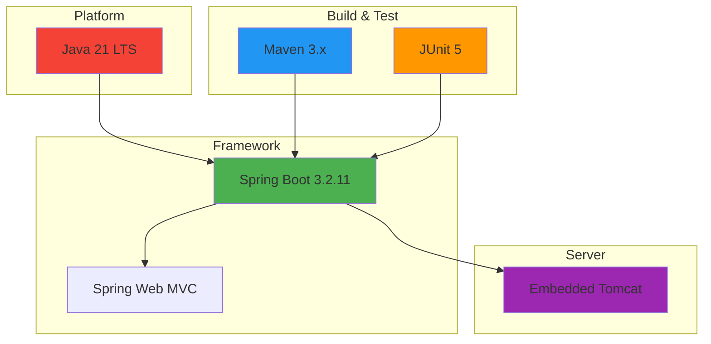

---

## 🎨 Skill Capabilities Matrix

| Skill | Trigger Keywords | Input Example | Output Type |
|-------|-----------------|---------------|-------------|
| 🧮 **CalculatorSkill** | calculate, compute, sum, math operators | `"calculate: 10 + 5"` | Numeric result |
| 🔍 **MockSearchSkill** | search, find, lookup | `"search: Spring Boot"` | Mock results list |
| 📝 **SummarizeSkill** | summarize, summary | `"summarize: Long text..."` | Shortened text |

---

## 🔀 Execution Patterns

### Pattern 1: Direct Skill Match

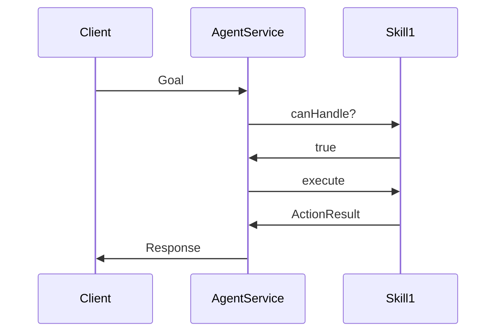

### Pattern 2: Multiple Skill Check

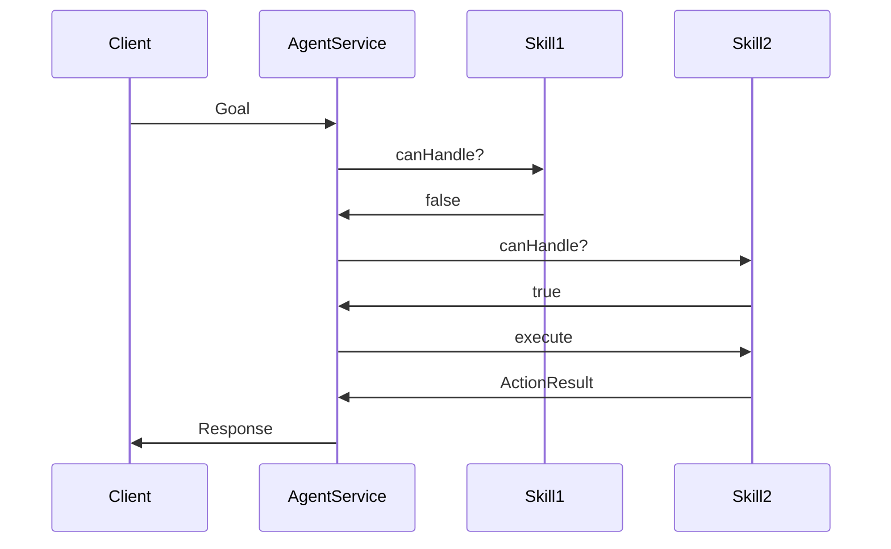

### Pattern 3: No Match Fallback

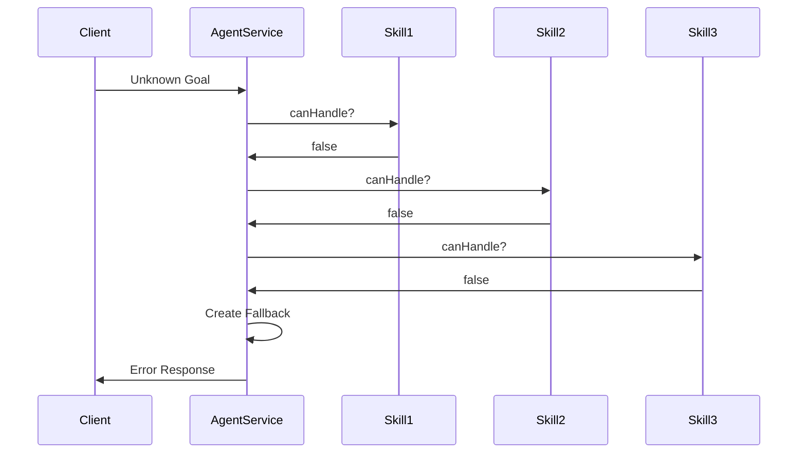

---

## 📐 Architecture Layers

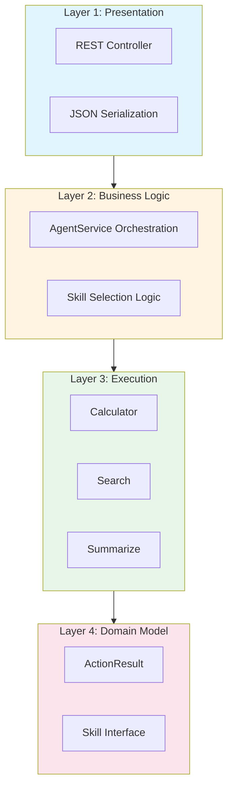

---

## 🚀 Deployment Options

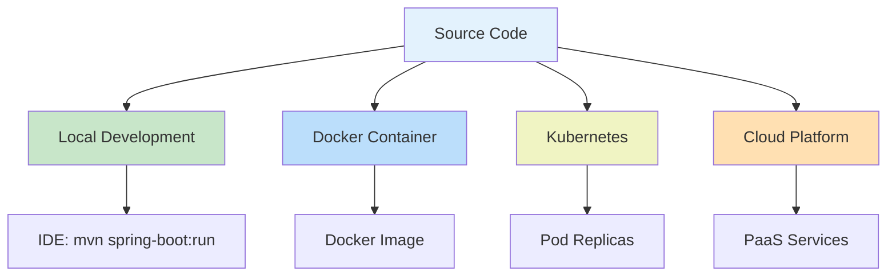

---

## 🔐 Request/Response Format

### Request Structure
```json
{
  "goal": "string - The task for the agent to execute"
}
```

### Response Structure
```json
{
  "goal": "string - Echo of original goal",
  "trace": [
    {
      "success": "boolean - Execution status",
      "skillName": "string - Skill that executed",
      "output": "string - Result data"
    }
  ],
  "finalOutput": "string - Last result in trace"
}
```

---

## 📈 Performance Characteristics

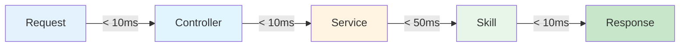

**Total Expected Response Time: < 100ms**

---

## 🔍 Key Design Patterns

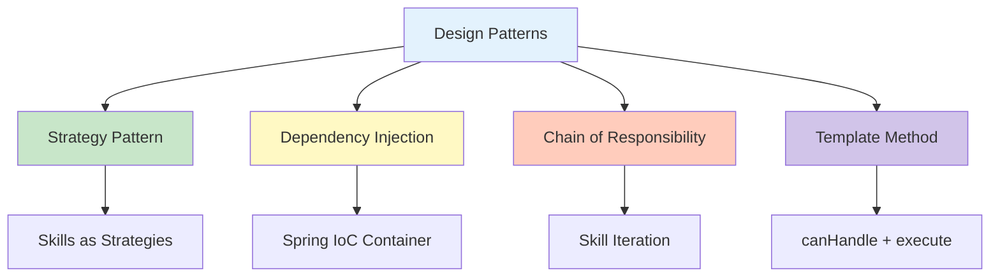

---

## 🧪 Test Coverage Overview

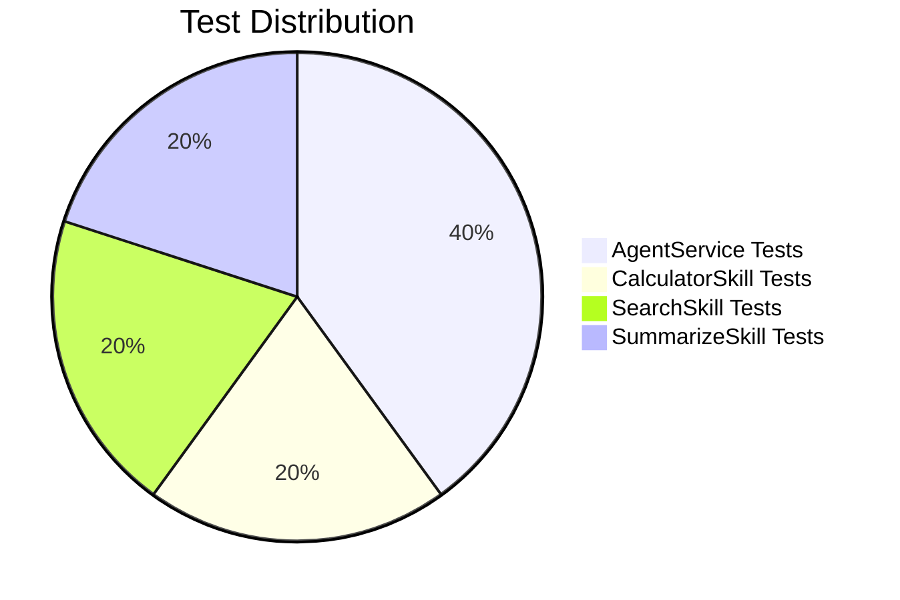

---

## 🎯 Extension Points

```mermaid
graph LR
    NewSkill[New Skill] -->|1. Implement| Interface[Skill Interface]
    Interface -->|2. Add| Component[@Component]
    Component -->|3. Auto-discover| Spring[Spring Container]
    Spring -->|4. Inject| Service[AgentService]
    Service -->|5. Available| Ready[Ready to Use]
    
    style NewSkill fill:#e3f2fd
    style Interface fill:#fff3e0
    style Component fill:#c8e6c9
    style Spring fill:#ffccbc
    style Ready fill:#d1c4e9
```

---

## 📊 Data Flow Summary

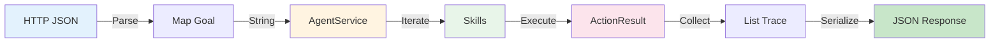

---

## 🛠️ Development Workflow

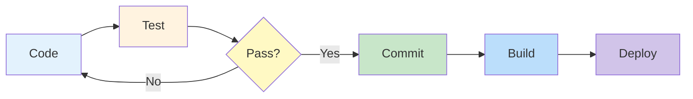

---

## 📍 Project Structure Map

```
📁 springai_agent_getting_started
├── 📁 src
│   ├── 📁 main
│   │   ├── 📁 java/com/example/agentdemo
│   │   │   ├── 🎯 AgentDemoApplication.java
│   │   │   ├── 📁 agent
│   │   │   │   ├── ⚙️ AgentService.java
│   │   │   │   ├── 📋 Skill.java
│   │   │   │   └── 📁 skills
│   │   │   │       ├── 🧮 CalculatorSkill.java
│   │   │   │       ├── 🔍 MockSearchSkill.java
│   │   │   │       └── 📝 SummarizeSkill.java
│   │   │   ├── 📁 controller
│   │   │   │   └── 🌐 AgentController.java
│   │   │   └── 📁 model
│   │   │       └── 📦 ActionResult.java
│   │   └── 📁 resources
│   │       └── ⚙️ application.properties
│   └── 📁 test
│       └── 📁 java
│           └── 🧪 AgentServiceTest.java
├── 📁 docs
│   ├── 📄 README.md
│   ├── 📄 ARCHITECTURE.md
│   ├── 📄 TECHNICAL_SPEC.md
│   └── 📄 INTERACTION_DIAGRAMS.md
├── 📄 pom.xml
└── 📄 README.md
```

---

## 🎓 Quick Start Commands

```bash
# Build
mvn clean install

# Test
mvn test

# Run
mvn spring-boot:run

# Package
mvn package

# Run JAR
java -jar target/springai-agent-demo-0.0.1-SNAPSHOT.jar
```

---

## 🔗 Quick Links

| Resource | Location |
|----------|----------|
| **Main README** | [README.md](../README.md) |
| **Architecture** | [docs/ARCHITECTURE.md](ARCHITECTURE.md) |
| **Technical Spec** | [docs/TECHNICAL_SPEC.md](TECHNICAL_SPEC.md) |
| **Interactions** | [docs/INTERACTION_DIAGRAMS.md](INTERACTION_DIAGRAMS.md) |
| **Source Code** | [src/main/java/](../src/main/java/) |
| **Tests** | [src/test/java/](../src/test/java/) |

---

## 📞 API Quick Reference

```http
POST http://localhost:8080/api/agent/execute
Content-Type: application/json

{
  "goal": "calculate: 15 + 27"
}
```

**Response:**
```json
{
  "goal": "calculate: 15 + 27",
  "trace": [{"success": true, "skillName": "CalculatorSkill", "output": "42.0"}],
  "finalOutput": "42.0"
}
```

---

*Visual Summary Version: 1.0*  
*Last Updated: November 8, 2025*  
*Project Version: 0.0.1-SNAPSHOT*
